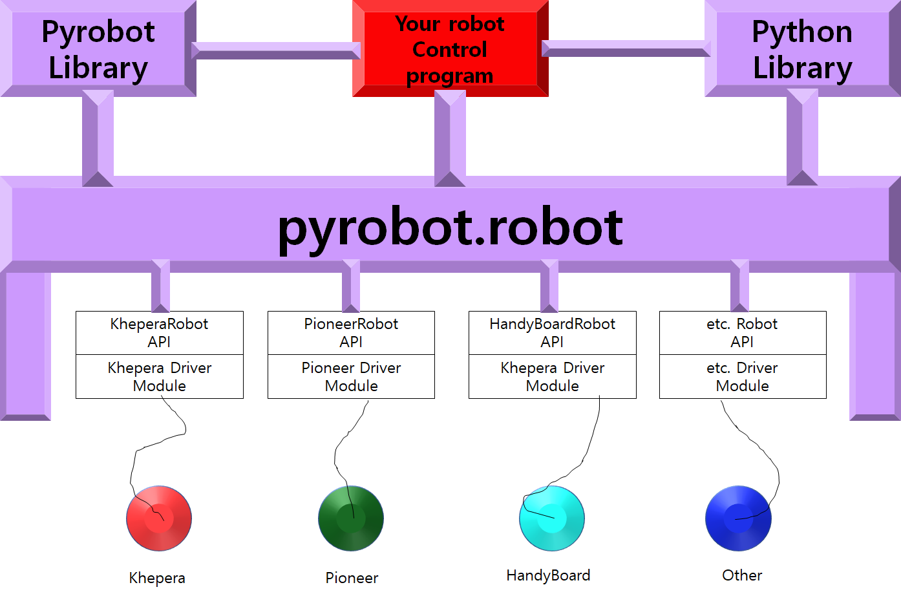

# Pyrobot README File
----------------

Welcome!

Dead pyrobot2 library have ported on python3 envrioment succesfuly.

Pyrobot2 was an very extensible, Educational AI based robot libarary, but it can not be opened these days.

To solve this problem, we analyzed this pyrobot libaray and tested. 

It was successfully tested on **Ubuntu 18.04**. 

Following steps are the successful case step. 

# What is benefit of 

'Extensible' and 'Editable' are two worlds that fully explain this library.

You can learn this robot simulation libaray and change python source code manually.

If you click the button that you configured (world, robot, brian.. etc), you can see raw source of this libarary and change it by Vim editor.

# How to learn - basic way

### 1. First just clone this project and change this folder name as pyrobot3 -> pyrobot `mv pyrobot3 pyrobot`

### 2. `cd /pyrobot/bin/` and `python3 pyrobot` 

### 3. Click Server: and choose PyrobotSimulator and choose Tutorial.py as a World. You should get a window showing a top view of a simulated room containing a robot and a few walls.

### 4. In the interface window, click Robot: and choose PyrobotRobot60000.py

### 5. Click Brain: and choose Avoid.py

### 6. Click Run to make the robot wander around the simulated room

# Other Features

1. You can setting world, robot, plugin and you can save by File - Save current config as. As to do this, you can open saved configuration without additional click!

2. How to multiple robots can be one world? It can be implemented by open multiple terminal. First, you should open one terminal, and select one server, select corresponding robot - I highly recommend 'pyrobot60000'.

   And then, open another terminal but don't select the server! You should select another robot that can be on diffrent port number. If you click robot or world, you can check each source of the enviroments.  

3. Even if some combination of World - Robot - Brain cannot be work correctly, Don't be worry. World's source is specification of which, how, specific robot can be on. By port number and device information, you can run this corrctl

4. You can change the source in this code in your creative way. Making world, Robot, Brain source is not as hard you think! 

# Modules

## World

pyrbot map. you should check world. Almost every world can be work.

## Robot

Pyrobot robot 

## Brain

Brain determin how to move 

# Example Combination of available plugins

| world           | robot          | plugin                                          |
| --------------- | -------------- | -----------------                               |
| AndrewHallway   | pyrobot60000   | Subsumption.py                                  |
| AndrewHallway   | pyrobot60000   | Slider.py                                       |
| AndrewHallway   | pyrobot60000   | SimpleWander.py   ( just wander around )        |
| AndrewHallway   | pyrobot60000   | SimpleBrain.py (It dosen't have any brain logic |
| AndrewHallway   | pyrobot60000   | Subsumption                                     |

